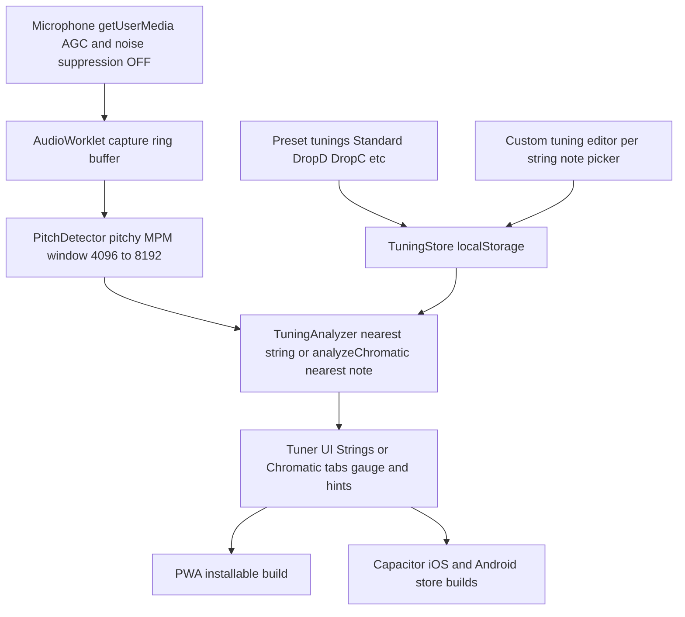

# AnyTune — Custom-Tuning Guitar & Bass Tuner (Mobile)

## Status

Steps 1–7 are complete: the app works as an installable PWA with editable
per-string tunings, presets, custom tuning persistence, and live pitch detection
(verified end-to-end with synthetic mic input, including 43.65 Hz F1 in unit tests).

**Chromatic tab:** Strings | Chromatic screen switch. Chromatic uses the same mic
pipeline and `analyzeChromatic` (nearest 12-TET note + cents); no string list or
tuning picker. Session-only screen mode.

Repo-local knowledge graph lives under `docs/knowledge/`. Portable protocol:
`AGENT_PROTOCOL.md` + root `AGENTS.md` (ChatGPT/Codex, Claude, Copilot, Cursor).
Cursor also has `.cursor/rules/knowledge-graph.mdc`. Automation: `knowledge:refresh`
(file inventory), `knowledge:check` (CI job), wiki sync on `master`
(`.github/workflows/knowledge-wiki.yml`).

Remaining:

- Step 8 (Capacitor shell) — not started; requires Xcode / Android Studio.
- Step 9 (real-device testing) — needs a physical phone and instrument; thresholds
  in `src/audio/pitchDetector.ts` and `src/core/tunings/analyzer.ts` may need tuning
  after that.
- Deployment to a static host for link-based install distribution.

## Idea review: is it worth building?

Yes. GuitarTuna locks custom/editable tunings behind a paid subscription, and most free tuners only offer fixed presets. A free tuner where you type any note per string (e.g. G#-D#-A#-F for Meshuggah's Demiurge) fills a real gap for non-professional musicians.

One real technical risk to plan for: **very low bass notes** (F1 ≈ 43.7 Hz, and lower for extended-range tunings) are hard to detect. Pitch detection needs a large analysis window (~4096–8192 samples) and a good algorithm (McLeod/YIN, not naive FFT peak). This is solvable and we design for it from day one.

## Platform decision: mobile-only, one codebase, Capacitor

Requirements: mobile app for Android and iOS, one TypeScript codebase, installable **before** the stores, and — top priority — **clean microphone input**.

Chosen approach: **web app (React + TypeScript) wrapped in Capacitor**.

- **Install before stores:** the same build is deployed as a PWA — anyone installs it from a link, today. Capacitor builds produce the store binaries later, no rewrite.
- **Microphone quality (priority #1):** the Web Audio API gives raw PCM samples via `AudioWorklet` and lets us explicitly disable `echoCancellation`, `noiseSuppression`, and `autoGainControl` — mandatory for a tuner, since those filters eat exactly the low-frequency content of bass strings. This works identically in the browser and inside Capacitor's webview (iOS WKWebView supports `getUserMedia`). React Native, by contrast, has _no_ built-in raw audio access and relies on third-party native modules — the riskier option for this app.
- **Gestures:** taps/swipes/drags needed by a tuner work fine with web pointer events.

### Future migration path to React Native (if ever needed)

Kept cheap by an architectural rule: **`src/core/` must be pure TypeScript — no DOM, no React, no browser APIs.** Pitch math, music theory, tuning models, and analysis logic all live there and would port to React Native unchanged. Only `src/audio/` (mic adapter) and `src/components/` (UI) are platform-bound. Enforced with an ESLint import restriction on `src/core/`.

## Stack

- **Vite + React + TypeScript (strict mode)**, `vite-plugin-pwa`
- **Web Audio API + AudioWorklet** for mic capture
- **`pitchy`** (McLeod Pitch Method) for pitch detection
- **Capacitor** for iOS/Android store builds
- **No backend.** Custom tunings stored in `localStorage`. Cloud sync can be added later if ever wanted.
- **Vitest** for unit tests

## Code quality rules (ruff/complexipy equivalents for TypeScript)

Ruff and complexipy are Python-only tools; the TypeScript equivalents, enforced via a single `npm run check` command (lint + format check + typecheck + tests) suitable for pre-commit and CI:

- **ESLint** with `typescript-eslint` strict-type-checked config (= ruff role)
- **`eslint-plugin-sonarjs`** with `cognitive-complexity: 10` (= complexipy role), plus `complexity` (cyclomatic ≤ 10), `max-lines-per-function: 50`, `max-depth: 3`
- **Prettier** for formatting (= ruff format)
- Rules documented in `.cursor/rules/` so the agent always follows them

## Architecture

Project layout (portability rule baked in):

- `src/core/music/` — pure functions: note-to-frequency, frequency-to-nearest-note, cents offset
- `src/core/tunings/` — `Tuning` model, built-in presets, analyzer logic
- `src/audio/` — platform adapter: mic capture, AudioWorklet processor, pitchy wrapper
- `src/components/` — tuner gauge, string selector, tuning editor, preset picker
- `src/state/` — app state (active tuning, detected pitch, auto mode)
- `src/storage/` — localStorage persistence behind a small interface

## Detailed technical plan (junior-developer level)

### 1. Scaffold the project

1. Create `~/Projects/anytune`, run `git init`, move the agent workspace into it.
2. Copy this plan into the repo as `docs/DEVELOPMENT_PLAN.md` (architecture, decisions, and the step-by-step breakdown) so other agents and developers work from the same source of truth. Keep it updated as steps complete; a short `AGENTS.md` at the repo root points to it and to the code-style rule.
3. Scaffold with `npm create vite@latest . -- --template react-ts`, then `npm install`.
4. In `tsconfig.json` confirm `"strict": true`; add `"noUncheckedIndexedAccess": true`.
5. Verify `npm run dev` serves the starter page. First commit.

**Done when:** dev server runs, repo has an initial commit including `docs/DEVELOPMENT_PLAN.md` and `AGENTS.md`.

### 2. Code quality tooling

1. Install dev deps: `typescript-eslint`, `eslint-plugin-sonarjs`, `prettier`, `eslint-config-prettier`, `vitest`.
2. Create `eslint.config.js` (flat config): `strictTypeChecked` + `stylisticTypeChecked`, sonarjs `cognitive-complexity: ["error", 10]`, core `complexity: ["error", 10]`, `max-lines-per-function: ["error", 50]`, `max-depth: ["error", 3]`.
3. Add the portability guard: `no-restricted-imports` rule scoped to `src/core/**` forbidding imports of `react`, anything in `src/components`, `src/audio`, and DOM-touching modules.
4. Add `.prettierrc`, and scripts: `lint`, `format:check`, `typecheck` (`tsc --noEmit`), `test`, and `check` that runs all four.
5. Write `.cursor/rules/code-style.md`: functions small and single-purpose, no `any`, prefer pure functions in `core`, every `core` module gets unit tests, run `npm run check` before finishing any task.

**Done when:** `npm run check` passes on the clean scaffold.

### 3. Music theory core (`src/core/music/`)

Pure math, no dependencies — write tests first.

1. `notes.ts`: define `NOTE_NAMES = ["C","C#","D",...,"B"]` and a `Pitch` type `{ note: NoteName; octave: number }`. Implement `pitchToMidi(pitch): number` (C4 = MIDI 60) and `midiToPitch(midi): Pitch`.
2. `frequency.ts`: `midiToFrequency(midi) = 440 * 2^((midi - 69) / 12)` and its inverse `frequencyToMidiFloat(freq)` (returns a float, e.g. 61.3).
3. `cents.ts`: `centsBetween(actualFreq, targetFreq) = 1200 * log2(actual / target)`. Positive = sharp (loosen), negative = flat (tighten).
4. Tests (Vitest): A4 = 440 Hz, E2 ≈ 82.41 Hz, F1 ≈ 43.65 Hz, G#1 ≈ 51.91 Hz (the Demiurge strings), cents symmetry, midi round-trips.

**Done when:** all tests green, functions documented with one-line JSDoc.

### 4. Audio engine (`src/audio/`)

1. `micStream.ts`: request the mic with `navigator.mediaDevices.getUserMedia({ audio: { echoCancellation: false, noiseSuppression: false, autoGainControl: false } })`. Handle denial with a typed error the UI can render. Create an `AudioContext` and resume it inside a user-gesture handler (mobile requirement).
2. `capture-processor.ts` (AudioWorklet): copy incoming 128-sample frames into a ring buffer; post a `Float32Array` of the latest 8192 samples to the main thread every ~100 ms.
3. `pitchDetector.ts`: wrap `pitchy`'s `PitchDetector.forFloat32Array(8192)`. Return `{ frequency, clarity }`; discard results with `clarity < 0.9` or frequency outside 30–1000 Hz. 8192 samples at 48 kHz ≈ 170 ms — enough periods of a 43 Hz F1 for a stable reading.
4. `usePitch.ts` React hook: starts/stops the pipeline, exposes `{ status, frequency, clarity }`, applies a median filter over the last 5 readings to stop needle jitter.

**Done when:** a debug view shows a stable frequency for a played note, including low bass (test with a recording or tone generator at 43.65 Hz).

### 5. Tuning model (`src/core/tunings/` + `src/storage/`)

1. `types.ts`: `InstrumentString = { pitch: Pitch }`, `Tuning = { id, name, instrument: "guitar" | "bass", strings: InstrumentString[] }`.
2. `presets.ts`: Standard E (guitar), Drop D, Drop C#, Drop C, Half-step down, Standard bass 4/5-string, Drop D bass. Store as data, not code.
3. `analyzer.ts`: `analyze(frequency, tuning)` — find the string whose target frequency is nearest (log scale), compute cents offset, return `{ stringIndex, cents, direction: "tighten" | "loosen" | "in-tune" }` with in-tune = |cents| ≤ 5.
4. `src/storage/tuningStore.ts`: `listCustom() / save(tuning) / remove(id)` over `localStorage` under one JSON key, versioned (`{ v: 1, tunings: [...] }`) for future migrations.
5. Tests: analyzer picks correct string for frequencies between two strings; Demiurge tuning (G#1 D#2 A#2 F1... i.e. per-string custom values) resolves correctly.

**Done when:** tests green; saving/loading a custom tuning survives page reload.

### 6. Tuner UI (`src/components/`, `src/state/`)

1. `src/state/appState.ts`: React context or a tiny store holding `activeTuning`, `autoMode`, current analysis result.
2. `TunerGauge.tsx`: needle/arc showing −50..+50 cents, target note in the center, green when in-tune. SVG, animated with CSS transform (no re-render per frame).
3. `StringList.tsx`: one button per string showing its note+octave; highlights the string the analyzer picked in auto mode; in manual mode tapping selects the target string.
4. `NotePicker.tsx`: opens when the user long-presses/edit-taps a string — pick note name and octave; edits create an unsaved "Custom" copy of the current tuning with a "Save as..." action.
5. `PresetPicker.tsx`: list of built-in presets + saved customs, grouped by instrument.
6. `TuneDirectionHint.tsx`: text like "String 4 (F1): too low — tighten" driven by the analyzer result.
7. Dark theme similar to the GuitarTuna reference; large touch targets; UI strings in a single `strings.ts` module ready for RU/EN localization.

**Done when:** full flow works in a desktop browser with a real guitar or tone generator: pick preset → edit a string to any note → play → needle and hint respond correctly.

### 7. PWA packaging

1. Add `vite-plugin-pwa`: manifest (name, dark theme color, portrait orientation), generated icons, offline-capable service worker (the app has no network calls, so precache everything).
2. Add an install hint UI for iOS Safari ("Share → Add to Home Screen").
3. Deploy the static build (any static host) so the app is installable from a link — this is the "before the stores" distribution.

**Done when:** app installs to a phone home screen and works offline; mic works from the installed app.

### 8. Capacitor shell (store builds)

1. `npm install @capacitor/core @capacitor/cli`, `npx cap init anytune`, add `android` and `ios` platforms.
2. Android: add `RECORD_AUDIO` permission to the manifest. iOS: add `NSMicrophoneUsageDescription` to `Info.plist`.
3. `npx cap sync && npx cap run android` (emulator) and `npx cap run ios` (simulator) — verify mic capture works inside the webview.
4. Store submission itself is a later, separate effort (accounts, signing, listings).

**Done when:** the same web build runs as a native app on both an Android emulator and an iOS simulator with working microphone.

### 9. Polish

1. Test on at least one real Android and one real iOS phone: noisy room, quiet room, low bass strings.
2. Tune thresholds (clarity cutoff, in-tune cents window, median filter length) based on real testing.
3. Ensure `npm run check` is green; review test coverage of `src/core/`.
